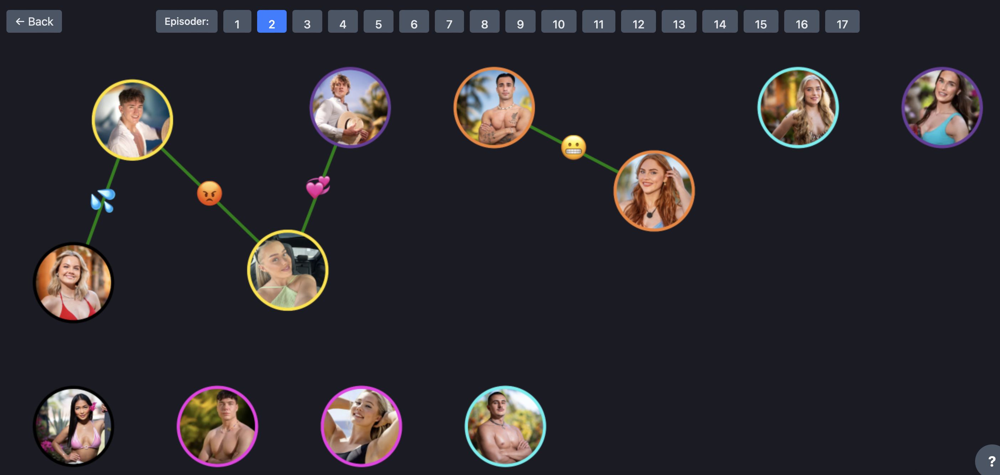

# Labyrintenfinale 2025

Dette repoet er utgangspunkt for caseoppgaven i Labyrintenfinalen 2025. Labyrinten er en årlig konkurranse av Bekk consulting, hvor hvert vinnerlag blir sendt til en finale i Oslo. Laget jeg var en del av vant linjeforeningens konkurranse i Trondheim, og derfor var med til Oslo. Casen gikk ut på å utvikle et produkt for en norsk strømmetjeneste, som skulle hjelpe til å beholde på abonentene deres. Vi valgte derfor å lage "Plotlines". Plotlines skal være en integrert del av streamingtjenester som skal blio brukt på realityprogram. Hvis en seer faller av et program, eller lurer på hva som har skjedd tildigere, kan de åpne et interaktivt nodekart for å finne informasjonen.

### English:
This repository serves as the starting point for the case challenge in Labyrintenfinalen 2025. Labyrinten is an annual competition organized by Bekk Consulting, where each winning team is sent to a final in Oslo. The team I was part of won our student association's competition in Trondheim, and therefore participated in the Oslo finals. The case focused on developing a product for a Norwegian streaming service aimed at helping them retain subscribers. We therefore created "Plotlines." Plotlines is designed to be an integrated part of streaming services specifically for reality shows. If a viewer falls behind on a show or wonders what happened previously, they can open an interactive node map to find the information.

## Overview

This repository provides a starting point for the Labyrintenfinalen 2025 case challenge. It includes:

- A React + TypeScript + Vite frontend
- An Express + TypeScript backend with a tips API
- A development environment setup for building a web application


## Example




## Getting Started

### Prerequisites

- Node.js (version 18 or newer recommended)
- npm or yarn

### Installation

1. Clone the repository:
    ```bash
    git clone https://github.com/bekk/labyrintenfinale-hack-sparrow
    cd labyrintenfinale-hack-sparrow
    ```

2. Install dependencies:
    ```bash
    # Install frontend dependencies
    cd labiryntenfinale-hack-sparrow
    npm install
    

3. Run the application:
    ```bash
    # In a new terminal, start the application
    npm run dev
    ```

## Project Structure

- `/frontend`: React application built with TypeScript and Vite
- `/docs`: Documentation and additional resources

## Development

The frontend runs on `http://localhost:3000` by default,

## License

This project is provided as part of the Labyrintenfinalen 2025 challenge.